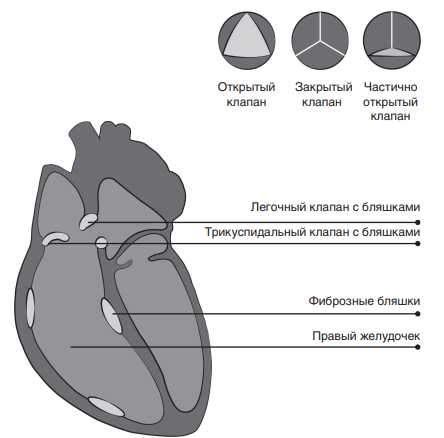

    <b>Синдром</b> - это набор специфических симптомов. Если врач говорит,
    что у вас синдром, связанный с НЭО, это означает, 
    что ваш организм сигнализирует о заболевании определенными признаками, 
    закономерно связанными между собой. Важно понимать, на какие именно симптомы вам
    стоит обращать внимание и как на них реагировать.

 
 

<h2> Карциноидный синдром </h2>

    Карциноидный синдром возникает при избыточной секреции серотонина и некоторых других гормонов. Вы могли замечать у себя
    проявления данного синдрома при
    наличии у вас первичной НЭО кишечника, легких или яичников или
    при метастазировании в печень.
    К типичным симптомам карциноидного синдрома относят:
    <ul>
        <li> 
            Приливы (покраснение в области грудной клетки и лица, в ряде случаев - во всем теле). 
            Обычно это сухие приливы, не обязательно сопровождающиеся потливостью (характерной для приливов при менопаузе).
        </li>
        <li>Спастические боли в животе</li>
        <li>Диарея</li>
        <li>Потеря или снижение аппетита</li>
        <li>Учащенное сердцебиение (может сопровождать приливы)</li>
        <li>Свистящие хрипы</li>
        <li>Боль в желудке и/или боль в животе</li>
        <li>Утомляемость</li>
        <li>Изменения кожи</li>
        <li>Карциноидная болезнь сердца</li>
    </ul>

 
 

<h2> Лечение приливов </h2>

    Многие пациенты с карциноидным синдромом отмечают у себя
    такое неприятное явление, как приливы. Бороться с ними будет легче,
    если вы будете владеть информацией о факторах, провоцирующих
    данное явление. К пусковым механизмам (триггерам) приливов могут
    относиться:
    <ul>
        <li>Прием алкоголя и/или кофеина</li>
        <li>Прием обильной или острой пищи</li>
        <li>
            Прием пищи, содержащей вещество - тирамин, или любой пищи,
            богатой аминами. Такой, как многие сыры (исключая рикотта, творог
            или творожный сыр), а также соленое и маринованное мясо и рыба,
            маринованные бобы, некоторые
            фрукты и овощи (подробнее мы поговорим о питании в разделе 5)
        </li>
        <li>Перенапряжение</li>
    </ul>

    Некоторые пациенты отмечают,
    что чрезмерная физическая нагрузка или простой наклон головы
    вниз могут вызывать приливы. Вам
    следует обращать внимание на
    собственные ощущения при возникновении вышеперечисленных
    триггерных факторов и стараться
    минимизировать их.

 
 

<h2> Карциноидная болезнь сердца </h2>

    <b>Карциноидная болезнь сердца</b> - это поражение сердца, являющееся радикальным проявлением
    карциноидного синдромома. К сожалению, она затрагивает до 80%
    пациентов с карциноидным синдромом.
    Для определения уровня серотонина проводят анализ мочи
    (5HiAA). Также может быть выполнен анализ крови (Pro-BNP) для
    оценки риска развития карциноидной болезни сердца. Кроме того,
    пациенту может быть рекомендовано проведение ЭКГ и/или эхокардиографии. Более подробная
    информация об исследованиях
    представлена на с. 38.
    При избыточной секреции серотонина в области сердечных
    клапанов образуются характерные
    плотные бляшкообразные утолщения, образованные фиброзной
    тканью. Это может мешать нормальному открытию и закрытию
    клапанов, препятствуя нормальному кровотоку, а значит, вызывать
    одышку, сильную усталость и прочие недомогания. В этой ситуации
    пациенту требуется лечение или
    операция на сердце с целью замены поврежденных клапанов.

 

 

<h2> Клиническая гипогликемия </h2>

    <b>Этот синдром в подавляющем большинстве случаев вызван инсулиномой</b> - опухолью
    поджелудочной железы, которая
    приводит к гиперсекреции гормона
    инсулина. Как известно, инсулин
    отвечает за снижение уровня глюкозы в крови, избыточное же его
    количество приводит к чрезмерному падению уровня глюкозы, что
    чревато опасными последствиями.

    Симптомы пониженного сахара в крови включают потливость,
    чувство голода, головокружение,
    необычную бледность лица, дезориентацию и возбудимость. Если
    уровень сахара резко падает до
    экстремально низкого, вы можете
    потерять сознание или даже впасть
    в предкоматозное состояние.

    Часто пациенты с инсулиномой набирают вес, поскольку их
    одолевают симптомы голода и головокружения, а прием пищи через краткие промежутки времени
    помогает им облегчить состояние

    Сочетание трех симптомов,
    свидетельствующих о развитии у
    человека инсулиномы, называют
    Триадой Уиппла. К данным симптомам относятся:
    <ul>
    <li>признаки гипогликемии;</li>
    <li>падение уровня глюкозы в крови до 2,5 ммоль/л;</li>
    <li>
        обратимость симптомов гипогликемии при введении глюкозы
        внутривенно или приеме богатой
        сахаром пищи.
    </li>
    </ul>

 
 

<h2> Клиническая гипогликемия </h2>

    СЗЭ возникает, когда НЭО
    поджелудочной железы или двенадцатиперстной кишки продуцируют в кровоток избыточное количество гормона гастрина. Гастрин
    контролирует продукцию соляной
    кислоты в желудке, что обеспечивает правильную кислотность желудочного сока. Избыточное количество гастрина может вызывать
    язвы желудка и/или двенадцатиперстной кишки и кровотечения. 

    Симптомы СЗЭ включают:
    рефлюкс (отток соляной кислоты в
    пищевод), изжогу, боль в желудке
    или даже грудной клетке, отрыжку,
    диарею и анемию (низкий уровень
    железа).

    Уровень гастрина может быть
    проверен с помощью анализа крови.

    Если же вы принимаете препараты-ингибиторы протоновой
    помпы (ИПП) для лечения изжоги
    или рефлюкса соляной кислоты,
    то для получения точных результатов анализа перед исследованием
    вас попросят перейти на альтернативные препараты или прекратить
    прием ИПП. 

 
 

    Источник: 
    <a 
        style="color: blue" 
        href="https://vk.com/doc492172941_490970814?hash=9299bb54a36af80b02&dl=f915fcd8df0ebfa410"
        > брошюра пациента c НЭО
    </a>

