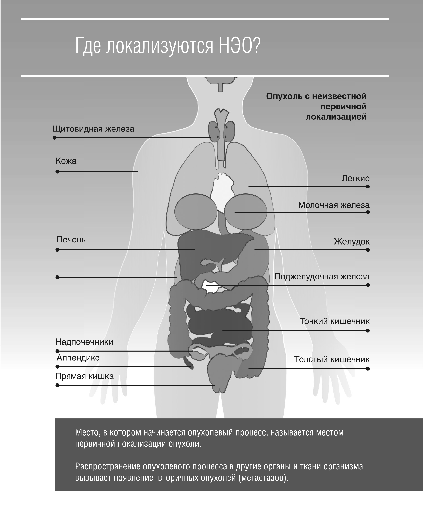

 
 

<h1 style="font-size: 20px; font-weight: bold"> Опухоль с неизвестной первичной локализацией </h1>

    Чаще всего при анализе имеющихся у вас симптомов и после обследования вашего организма определить первичную локализацию опухоли
    возможно. Если же диагностика вызывает затруднения, то врач называет это опухолью с неизвестной первичной локализацией. Как правило,
    первичная локализация опухоли не влияет на выбор тактики лечения.
    Кроме того, постоянно проводятся научные исследования, направленные
    на определение и идентификацию первичных опухолей более эффективными методами.

 
 

<h1 style="font-size: 20px; font-weight: bold"> Множественное эндокринное новообразование 1 (МЭН1) </h1>

    МЭН 1 - это наследственное состояние, которое приводит к развитию первично-множественных опухолей,
    обычно локализованных в поджелудочной железе, паращитовидных железах и гипофизе. Эти опухоли
    бывают злокачественными или доброкачественными и могут продуцировать огромное количество гормонов и других химических веществ, 
    которые затем высвобождаются в ткани организма.

 

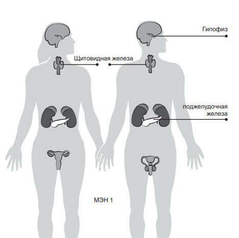

 

<h1 style="font-size: 20px; font-weight: bold"> НЭО щитовидной железы </h1>

    (Медуллярный рак щитовидной железы или МРЩЖ)
    Щитовидная железа - это орган внутренней секреции, расположенный в области шеи и вырабатывающий гормоны, регулирующие
    процессы обмена веществ. Так,
    работа поджелудочной железы
    сказывается на уровне артериального давления, температуре тела и
    даже сердечном ритме человека.

    МРЩЖ - это редкая НЭО, которая
    первоначально развивается в щитовидной железе, причем каждый
    четвертый случай ее возникновения вызван редким наследственным заболеванием

 

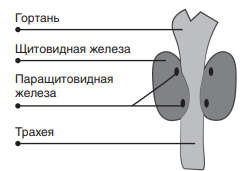

 

<h1 style="font-size: 20px; font-weight: bold"> НЭО легких </h1>

    НЭО легких составляют до 6% всех опухолей легких.
    Существует пять разных типов образований данной локализации: типичные НЭО легких, 
    атипичные НЭО легких, DIPNECH, мелкоклеточная нейроэндокринная карцинома, крупноклеточная нейроэндокринная карцинома.

    Примерно в 90% случаев речь идет о типичных НЭО легких (другое название - типичный карциноид). 
    Они характеризуются медленным течением и редко (менее чемв в 15% случаев) распространяются за пределы легочной ткани.
    Второй тип - атипичные НЭО (или атипичный карциноид) характеризуется более быстрым ростом.
    Вместе типичные и атипичные НЭО легких составляют около 40% всех НЭО. 
    Гормонально зависимые симптомы при НЭО легких встречаются редко, но у некоторых
    пациентов развивается карциноидный синдром.

 
    DIPNECH (диффузная идиопатическая легочная гиперплазия нейроэндокринных клеток) - очень
    редкая патология, при которой возникает увеличение нейроэндокринных клеток легких - иногда это
    очень маленькие опухоли (микроопухоли). Как правило, пораженные клетки неагрессивны, темпы их роста невысоки, 
    тем не менее, DIPNECH считается предраковым состоянием, поскольку угрожает трансформацией в типичные или
    атипичные НЭО легких. Мелкоклеточная нейроэндокринная карцинома и крупноклеточная нейроэндокринная карцинома - наиболее 
    редкие НЭО легких, но самые агрессивные опухоли. Для них характерна быстрая динамика развития.

 

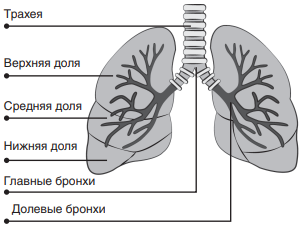

 

<h1 style="font-size: 20px; font-weight: bold"> НЭО кожи </h1>

    Карцинома Меркеля (КМ) - редкий тип рака кожи, который возникает в нейроэндокринных клетках,
    называемых клетками Меркеля. Это
    агрессивный тип НЭО кожи, может
    возникать как на поверхности кожи,
    так и под ее поверхностью.

 

 

<h1 style="font-size: 20px; font-weight: bold"> НЭО молочной железы </h1>

    НЭО молочной железы возникают крайне редко. Они обычно
    диагностируются, когда ткань исследуют на выявление более распространенных типов рака молочной железы.

 

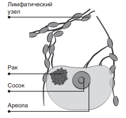

 

<h1 style="font-size: 20px; font-weight: bold"> НЭО надпочечников </h1>

    Надпочечники расположены
    над почками и секретируют гормоны, отвечающие за реакцию на
    стресс и контроль артериального давления.
    Существует три типа НЭО, которые могут развиваться в надпочечниках или рядом с ними:
    адренокортикальная карцинома,
    феохромоцитома и параганглиома. 

    <b>Адренокортикальная карцинома (АКК)</b> - это рак наружного слоя надпочечников. 
    Он можетсопровождаться выделение огромного количества гормонов, включая адреналин, норадреналин и
    глюкокортикостероиды, такие как кортизол, которые обеспечивают
    поддержание артериального давления, а также уровня натрия хлорида и глюкозы.

    <b>Феохромоцитома и параганглиома</b>
    Феохромоцитомы - редкие опухоли надпочечников, возникающие из внутреннего слоя надпочечников, называемого мозговым
    слоем. Подобные опухоли могут возникнуть вне надпочечника, тогда они называются (экстранадпочечниковые) параганглиомы.

 

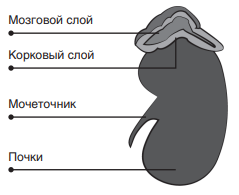

 

<h1 style="font-size: 20px; font-weight: bold"> НЭО печени </h1>

    НЭО печени относятся к нейроэндокринным опухолям редкой
    локализации. Если у Вас обнаружили НЭО печени, то, вероятнее
    всего, это вторичный очаг опухолевого процесса (метастаз). НЭО
    печени могут проявляться рядом
    симптомов, включая карциноидный синдром, даже при отсутствии
    первичного очага

    <b>Печень</b> - наиболее «излюбленное» место локализации вторичных НЭО 
    (тех, которые распространяются из других очагов),
    что частично связано с системой
    кровотока и с функцией данного
    органа.

 

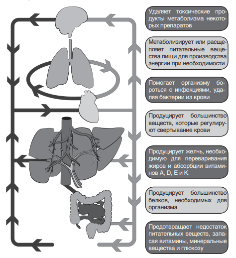

 

<h1 style="font-size: 20px; font-weight: bold"> НЭО желудка </h1>

    НЭО желудка встречаются крайне редко и составляют менее
    1% всех опухолей желудка. Существует три типа НЭО данной локализации.

    <b>НЭО желудка 1 типа</b> - опухоли малого размера и наименее
    агрессивные, часто бывают множественными. Это самый распространенный тип.

    <b>НЭО желудка 2 типа</b> - опухоли
    большего размера, могут давать
    метастазы.

    <b>НЭО желудка 3 типа</b> - самые
    большие НЭО желудка, с высокой
    вероятностью распространения.

 

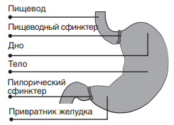

 

<h1 style="font-size: 20px; font-weight: bold"> НЭО поджелудочной железы </h1>

    <b>Поджелудочная железа</b> - это крупная железа, продуцирующая инсулин и другие гормоны, 
    регулирующие процессы углеводного, жирового и белкового обмена.
    НЭО поджелудочной железы могут быть как функционирующими
    (функционально активными), так и нефункционирующими (функционально неактивными).

    Функционирующие НЭО поджелудочной железы вызывают
    специфический набор симптомов(синдром).

    
    НЭО поджелудочной железы
    включают инсулиномы, гастриномы, ВИПомы, соматостатиномы и
    глюкагономы.

    Нефункционирующие НЭО
    поджелудочной железы не вызывают развития синдрома, но проявляются такими распространенными
    симптомами, как боль в спине, желтуха, боль в желудке и потеря веса.

 

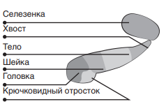

 

<h1 style="font-size: 20px; font-weight: bold"> НЭО двенадцатиперстной кишки </h1>

    Двенадцатиперстная кишка -
    это первый отдел тонкого кишечника, где начинает расщепляться
    пища, поступающая из желудка.

    НЭО двенадцатиперстной кишки могут вызывать сочетания симптомов, подобные тем, что вызывают НЭО поджелудочной железы
    или тонкого кишечника. 

 

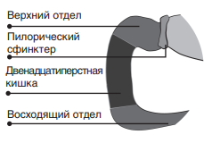

 

<h1 style="font-size: 20px; font-weight: bold"> НЭО тонкого кишечника </h1>

   Также называются тощекишечными, подвздошными или илеоцекальными НЭО. Это наиболее распространенные НЭО кишечника.

    НЭО тонкого кишечника характеризуются медленным ростом.
    Они могут вызывать симптомы,
    подобные синдрому раздраженного кишечника или карциноидного синдрома или же, напротив, не
    проявлять никаких симптомов.

    В связи с этим ранняя диагностика данных новообразований
    затруднительна, что, к сожалению,
    часто приводит к постановке диагноза лишь при выявлении распространенного опухолевого процесса.

 

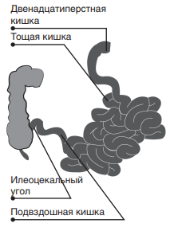

 

<h1 style="font-size: 20px; font-weight: bold"> НЭО аппендикса </h1>

    НЭО аппендикса - редкие опухоли, которые обычно обнаруживаются
    при проведении лечебных манипуляций или обследований на предмет
    других заболеваний, например, во
    время хирургического вмешательства при подозрении на аппендицит.

    Аппендикулярные опухоли размером менее 1 см часто удаляются
    во время операции. В случае если
    опухоль достигла большего размера
    или произошел разрыв аппендикса,
    как правило, пациенту требуется
    дальнейшее обследование и назначение дополнительного лечения.

    Есть и еще один редкий тип
    опухоли, которая может развиться в аппендиксе. Это бокаловидноклеточная карцинома,
    характеризующаяся дисплазией
    (патологическим изменением) бокаловидных клеток. Она более
    агрессивна, чем НЭО аппендикса,
    и часто метастазирует. 

 

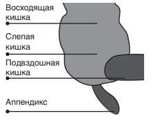

 

<h1 style="font-size: 20px; font-weight: bold"> НЭО яичников </h1>

    НЭО яичников, как правило, являются вторичными (или метастатическими), новообразованиями,
    возникшими в результате распространения клеток первичной опухоли в кишечнике или аппендиксе.

    Первичные НЭО яичников
    крайне редки. Так, например, в Великобритании они диагностируются
    примерно у 30 женщин в год. В связи с редкой встречаемостью таких
    опухолей информация о них весьма
    ограничена.

    Существуют два наиболее
    распространенных типа - нейроэндокринная опухоль (НЭО) яичника
    и нейроэндокринная карцинома
    (НЭК) яичника.

    Нейроэндокринные опухоли
    отличаются низкой или средней
    степенью злокачественности, т.е.
    медленным ростом, в то время как
    нейроэндокринные карциномы характеризуются высокой степенью
    злокачественности и ведут себя
    подобно раку яичников. Некоторые
    НЭО яичников могут вызывать карциноидный синдром.

 

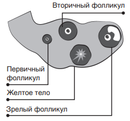

 

<h1 style="font-size: 20px; font-weight: bold"> НЭО шейки и тела матки </h1>

    НЭО шейки и тела матки встречаются еще реже, чем НЭО/НЭК
    яичников. Как правило, эти виды
    опухолей диагностируются только
    при исследовании тканей на предмет другого, более распространенного, рака данной локализации.
    Существует два основных типа:
    нейроэндокринные опухоли (НЭО)
    и нейроэндокринные карциномы
    (НЭК). Как и опухоли яичников,
    нейроэндокринные карциномы
    (НЭК) шейки и тела матки более
    агрессивны, чем нейроэндокринные опухоли (НЭО).

 

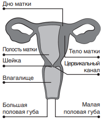

 

<h1 style="font-size: 20px; font-weight: bold"> НЭО влагалища и вульвы </h1>

    НЭО влагалища или вульвы -
    самые редкие опухоли НЭО, насчитывающие единичные случаи в мировой медицинской практике.

    Они классифицируются точно
    так же, как и НЭО яичников, шейки и тела матки, подразделяясь на
    нейроэндокринные опухоли и нейроэндокринные карциномы.

 
 

<h1 style="font-size: 20px; font-weight: bold"> НЭО яиек и предстательной железы </h1>

    НЭО яичек и предстательной
    железы обычно обнаруживаются
    только при обследовании по поводу
    другого рака

    как и НЭО женской половой
    системы, НЭо яичек и предстательной железы могут быть классифицированы как карциномы или
    опухоли в зависимости от их гистологической структуры.

    Надо сказать, что большой процент опухолей предстательной железы содержит нейроэндокринные
    опухолевые клетки. также доказано, что агрессивность опухоли напрямую связана с количеством в ней
    нейроэндокринных клеток. В связи
    с этим при НЭо предстательной железы может назначаться лечение
    аналогичное тому, что проводится
    при раке предстательной железы. 

 

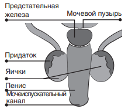

 

<h1 style="font-size: 20px; font-weight: bold"> НЭО толстого кишечника </h1>

    НЭо толстого кишечника встречаются достаточно редко и могут
    вызывать симптомы, общие для
    наиболее распространенных онкологических заболеваний кишечника, такие как: нарушение режима
    дефекации (например, диарея и / или запор), 
    боль в желудке или животе, потеря веса и кровотечение.

    НЭо толстого кишечника могут быть агрессивными и часто метастазируют.

 

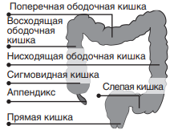

 

<h1 style="font-size: 20px; font-weight: bold"> НЭО прямой кишки </h1>

    НЭо прямой кишки, составляющие около 14% от всех НЭо
    кишечника и являющиеся самым
    распространенным их типом, в то
    же время, являются наименее распространенным колоректальным
    раком, составляя менее 1% от всех
    его случаев. НЭо прямой кишки
    могут проявляться такими симптомами, как кровотечение, запор
    или боль при дефекации, однако
    также могут длительно развиваться бессимптомно, что приводит к
    поздней диагностике. Примерно
    половина случаев НЭо прямой
    кишки диагностируется во время
    обследования и лечения по поводу
    других заболеваний.

 

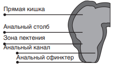

 

    Источник: 
    <a 
        style="color: blue" 
        href="https://vk.com/doc492172941_490970814?hash=9299bb54a36af80b02&dl=f915fcd8df0ebfa410"
        > брошюра пациента c НЭО
    </a>

