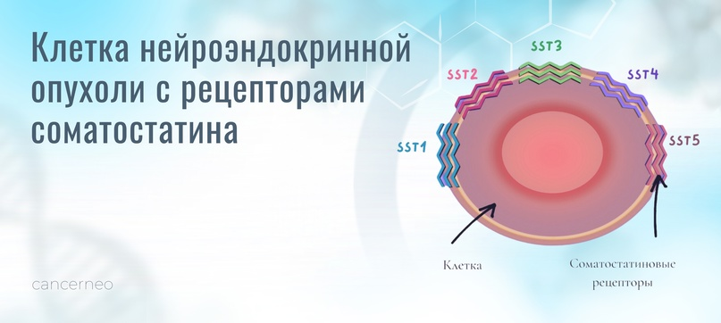
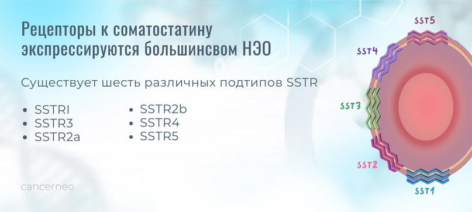
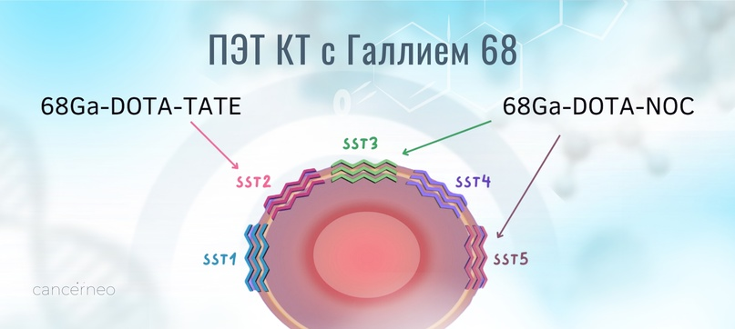

# Что это такое?

В зависимости от типа и степени злокачественности нейроэндокринные опухоли различаются по интенсивности экспрессии sstr того или иного типа.

Иммуногистохимическое исследование проводится с антителами к sstr 1, 2А, 3 и 5-го типов, основными из которых являются 2-ой и 5-й типы.

### **Для чего определять рецепторы соматостатина?**

Определение рецепторов соматостатина необходимо для диагностики НЭО посредством ПЭТкт, в котором используются несколько РФП, меченых галлием 68: 68Ga-DOTA-TATE, 68Ga-DOTA-NOC - это радиофармпрепараты, предназначенные для диагностики нейроэндокринных опухолей НЭО, имеющих соматостатиновые трансмембранные рецепторы. Самым распространенным РФП, который может быть использован при ПЭТ/КТ для визуализации НЭО, является 68Ga-DOTA-TATE экспрессирующих рецепторы подтипов SSTR2a и SSTR2b. Вторым по значимости принято считать 68Ga-DOTA-NOC-подтипа SSTR3 и SSTR5.
Диагностику можно пройти в рамках ОМС по форме направления 057-у и платно. Данное обследование проводят, если у вас G1 или G2.

*Подробно о ПЭТ с Ga68 и городах с данной диагностикой:*
https://telegra.ph/PEHT-s-68Ga-v-Rossii-08-26